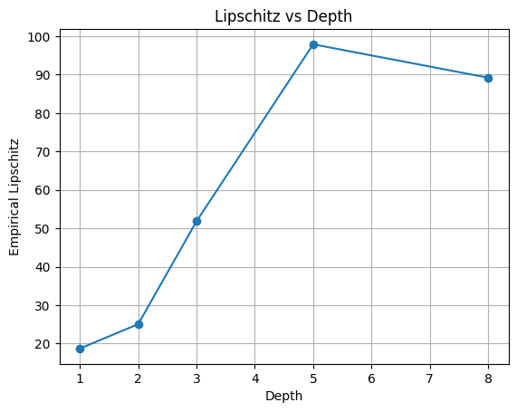

# Depth-Induced Representation Smoothness in Neural Networks

## 🚀 Overview
This project investigates how increasing depth in neural networks affects the geometry of learned representations.

While deep networks are known for their expressive power, this work explores a different perspective:
> Does increasing depth make representations smoother?

We show that deeper networks tend to produce smoother representations, where similar inputs map closer together in feature space.

---

## 🧠 Key Idea
As depth increases:
- Pairwise distances between representations contract  
- Intra-class variance reduces  
- Representations become more stable and structured  

👉 This suggests that depth acts as an **implicit regularizer**, not just a tool for expressivity.

---

## 📊 Experiments
We evaluate this hypothesis on:
- Synthetic datasets  
- MNIST  
- CIFAR-10

Metrics used:
- Pairwise distance contraction  
- Representation variance  

---

## 📈 Results

We observe a consistent contraction of representation distances as network depth increases.

## 👤 Author

Mohammed Faisal Shahzad Siddiqui  
Independent Researcher in Deep Learning  

Research Interests:
- Representation Learning  
- Neural Network Theory  
- Deep Learning  

📫 Open to collaborations and research opportunities
